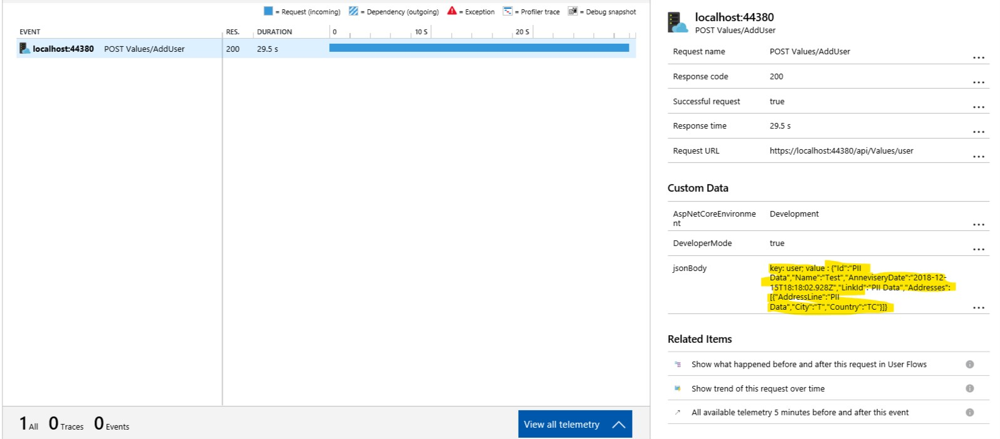

# ApplicationInsights.Extension.RequestLogging
Implements to log Request Body in application insights after removing the sensitive information.

[](https://dev.azure.com/amigup/amigup/_apis/build/status/amigup.ApplicationInsights.Extension.RequestLogging)

[](https://img.shields.io/nuget/v/ApplicationInsights.Extension.RequestLogging.svg?style=flat)

Download the package from [nuget.org](https://www.nuget.org/packages/ApplicationInsights.Extension.RequestLogging)

### Scenario

You want to log the Request Body in application Insights after removing the sensitive information so that in Appliation Insights the request body payload can be viewed.

### Details

This package is built on 
- ASP.Net Core 2.2 Web API.
- Microsoft.ApplicationInsights 2.8.1
- Newtonsoft.Json 12.0.1

### Setup

1. Add `RequestLogActionFilterAttribute` filter in the MVC pipeline.
```
services.AddMvc(options =>
 {
       options.Filters.Add<RequestLogActionFilterAttribute>();
 });
```

2. Register the `PIITelemetryInitializer`

```
services.AddSingleton<ITelemetryInitializer, PIITelemetryInitializer>();
```
### How to use

You can attach `PII` attribute over Properties, Class and Action method parameter.

#### Property

If `PII` attribute is attached over property then in Application Insights request log the actual value is substituted by `PII Data` string literal.

```
    public class User
    {
        [PII]
        public string Id { get; set; }

        public string Name { get; set; }

        public DateTime AnneviseryDate { get; set; }

        [PII]
        public int LinkId { get; set; }

        public List<Address> Addresses { get; set; }
    }
```

#### Class

If `PII` attribute is attached over class then object is not logged in Application Insights request log.

```
    [PII]
    public class User
    {
        
    }
```

#### Action method parameter

If `PII` attribute is attached over parameter then object is not logged in Application Insights request log.

```
        [HttpPost]
        public void Post([FromBody, PII] User user)
        {
        }
```

### Sample Application
The repository contains a sample application to demostrate the usage of `ApplicationInsights.Extension.RequestLogging`.

